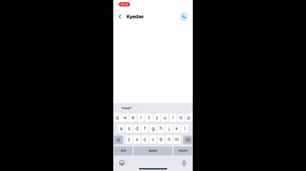
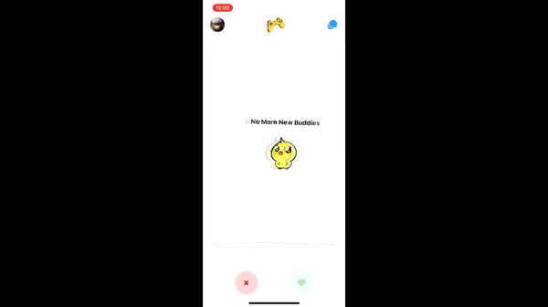
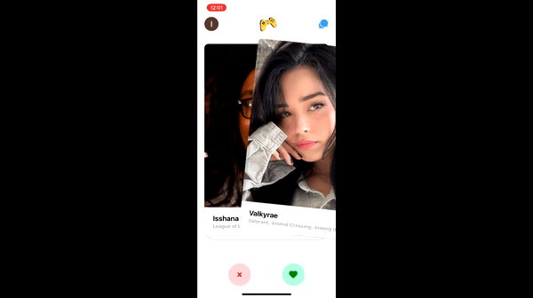
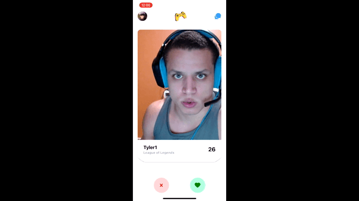
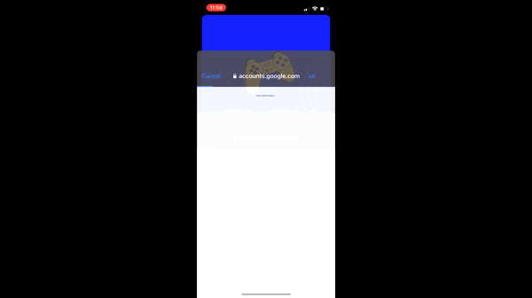

# PlayBuddies

Play Buddies is an iOS app that allows gamers to meet other gamers and expand their network. Find like-minded people and make gaming more fun with new friends. This app was created with **React Native** and has many key features such as Google Signin, 1-to-1 messaging and more!

View a demo here: 

## Key Features

### 1-to-1 Messaging
    

### User Authentication with Google Sign in
    
Sign in with a Google account and create a profile! To sign out tap your icon in the top left corner of the screen.

### Buddy Algorithm 
    

Match up and initializes chat window for two users who swipe right on each other.

### Swipeable cards
    

Swipe the cards left (pass on a buddy) or right (match with a buddy) or use the interactive buttons at the bottom of the screen.

### Customize Your Profile
    

### Other Features
* #### Clean UI/UX with Tailwind CSS
* #### Keyboard Friendly
* #### Extremely User Friendly

## Built With
* React Native
* Tailwind
* FireBase
* Expo
* Context API
* Google Auth

## Acknowledgements
* React Icons
* Expo Icons
* Sonny Sangha React Tutorials

